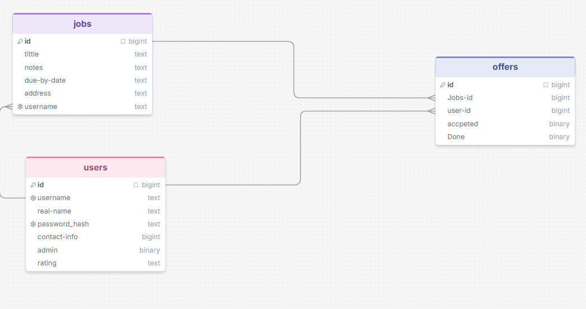
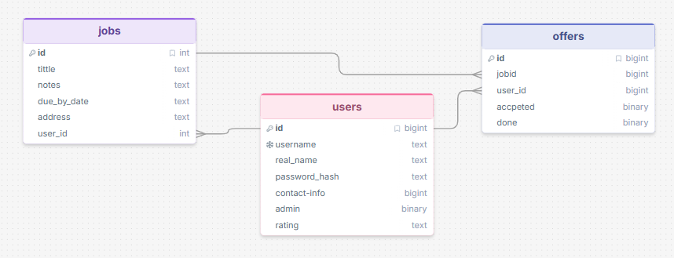

# Sprint 1 - Developing a DB and UI Prototype

## Sprint Goals

Develop a design for the database and a UI prototype that simulates the key functionality of the system. Test and refine the UI so that it can serve as the model for the next phase of development in Sprint 2.

### Specific Goals

**Edit these goals as needed**

- Design the database:
    - Tables
    - Fields / types
    - Primary keys
    - Default / nullable values
    - Relationships (foreign keys)
- Design the UI
    - Key pages
    - User interactions and 'flow'
    - Page layouts / features
    - Colour palette
    - Etc.

## Initial Database Design

this data base desing is so users can signin and eather create a job post or accapted a job somone else has posted 
this is what that data base looks like right now 

update some of the things in the data base is wroung as if i used - in the text the website would take it as an equation so i had to swap it put with _ insted 

### Required Data Input

when the user makes an account they will input their name the pasword (only hash pasword storded) their rough location 
and contact information. once job is done the user will be rated by the job owner on porformants 

### Required Data Output

the user information will be displayed but only for job owners and the other way around if they accpted each other e.g location and contact-info but before that the owner 
can see the user rating to deside if he wants this user for his job and his own rating is displayed on the job he posted 

### Required Data Processing

when processing the password we will hash it and add a salt so we aren't storing the password but the hash of one for 
safety reasions  

## UI 'Flow'

The first stage of prototyping was to explore how the UI might 'flow' between states, based on the required functionality.

This penport demo shows the initial design for the UI 'flow':

https://design.penpot.app/#/view?file-id=f0485fb1-4e63-8165-8008-3908e675a64e&page-id=f0485fb1-4e63-8165-8008-3908e675a64f&section=interactions&frame-id=0013c019-5066-804b-8008-39090ca72598&index=0&share-id=6956fb43-d0b4-807f-8008-4215d766031a

### Testing

I had one of my class friends move around and use what was their at the time  

### Changes / Improvements

I made changes as the end user around with it as not all conections where conected so i fixed that other wise no changes 

https://design.penpot.app/#/view?file-id=f0485fb1-4e63-8165-8008-3908e675a64e&page-id=f0485fb1-4e63-8165-8008-3908e675a64f&section=interactions&frame-id=0013c019-5066-804b-8008-39090ca72598&index=0&share-id=6956fb43-d0b4-807f-8008-4215d766031a

## Initial UI Prototype

The next stage of prototyping was to develop the layout for each screen of the UI.

This Figma demo shows the initial layout design for the UI:

https://design.penpot.app/#/view?file-id=64054412-1123-81ed-8008-5d1dfd684530&page-id=f0485fb1-4e63-8165-8008-3908e675a64f&section=interactions&frame-id=0013c019-5066-804b-8008-39090ca72598&index=0&share-id=64054412-1123-81ed-8008-5d1e25540347

### Testing

for the testing i had a few different user to test / play with it to make sure the layout is good and working

### Changes / Improvements

while testing the user recmend i had a feature where we could also deny users that apply for the job to shorten the list so i did that 
I also found i made a pontless page that I remove being the contact infomation 
page once accpting a user to do the job as yu could just see their information by clicking oin their account
also some users wanted to be login in as soon as they submited in the sign in page so i did they also wanted me to add a title to the first page so i called it job board because I didn't know what else to name it and they also said they wanted to change the seach when seaching for jobs to seach in locations rather than country as country may not be enough information to determ if this is a good job to do or not as it could still be too far away 

https://design.penpot.app/#/view?file-id=a234c67f-eb39-8116-8008-3f6d0a90e616&page-id=f0485fb1-4e63-8165-8008-3908e675a64f&section=interactions&index=0&share-id=bd31e32d-d69f-81e2-8008-6376d50a34bb

## Refined UI Prototype

Having established the layout of the UI screens, the prototype was refined visually, in terms of colour, fonts, etc.

This Figma demo shows the UI with refinements applied:  

I also did a few changes of my own I add a nav headder on to every page to make moving around easyer for any of the user's and they can allways cheach their rating when they want and I restantly just learned how to round the button and things so they don't look so blockey 

https://design.penpot.app/#/view?file-id=6956fb43-d0b4-807f-8008-4222f81ef218&page-id=f0485fb1-4e63-8165-8008-3908e675a64f&section=interactions&index=0&share-id=bd31e32d-d69f-81e2-8008-6375c5395cc1

### Testing

to test myself and a tester went though the prototype and descuss issuses and things

### Changes / Improvements

so the end users didn't like the color choice to much they though the idea of a blue and red was fine but not the way it's been done as I was told if I was to use red i should use it more 
and not just for the buttons and i was given a good site to use to find a good colour palate called realtime colour. after some exploring the differint colour palates I found a colour patten that 2 of my end users both like being this purple and dark blue style that you can see below

https://design.penpot.app/#/view?file-id=8694f143-a620-8054-8008-663903162af5&page-id=f0485fb1-4e63-8165-8008-3908e675a64f&section=interactions&frame-id=0013c019-5066-804b-8008-39090ca72598&index=0&share-id=6f06cb60-262a-804c-8008-6c7f6b25c952

## Sprint Review

Replace this text with a statement about how the sprint has moved the project forward - key success point, any things that didn't go so well, etc.
this sprint has helped my project because now i know what my website is going look like and how it will work in hand with the data base 

