# Sprint 2 - Implement Database and Display of Test Data

## Sprint Goals

Implement the database, populated with test data. Create queries that retrieve test data, and display this on web pages as needed. Test and refine the queries and data display, so that it stands as the basis of the next sprint.

### Specific Goals

**Edit these goals as needed**

- Implement the database
- Add test data to the database
- Create the following web pages:
    - Home pages showing...
    - Details page for ...
    - Etc.
- Develop SQL database queries to:
    - Retrieve all ...
    - Retrieve specific ...
    - Etc.

## haveing the db working 

here i wil be testing how well the db is working I will be doing this by given the db some seed data and 
attmp to get the first page working which will show the seed data for all the jobs  

**PLACE SCREENSHOTS AND/OR ANIMATED GIFS OF THE TESTING HERE**
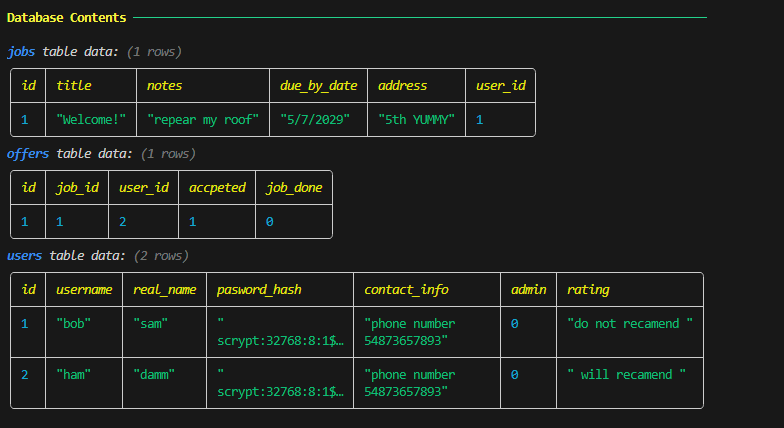
(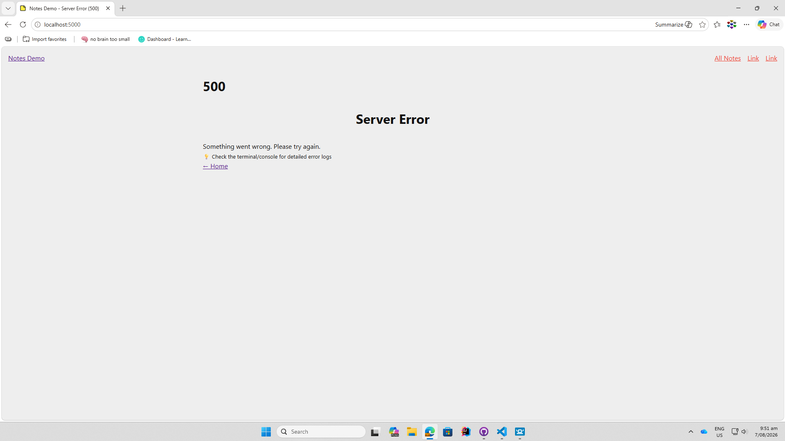)

the db is working but I wasn't able to put it onto the first page yet 
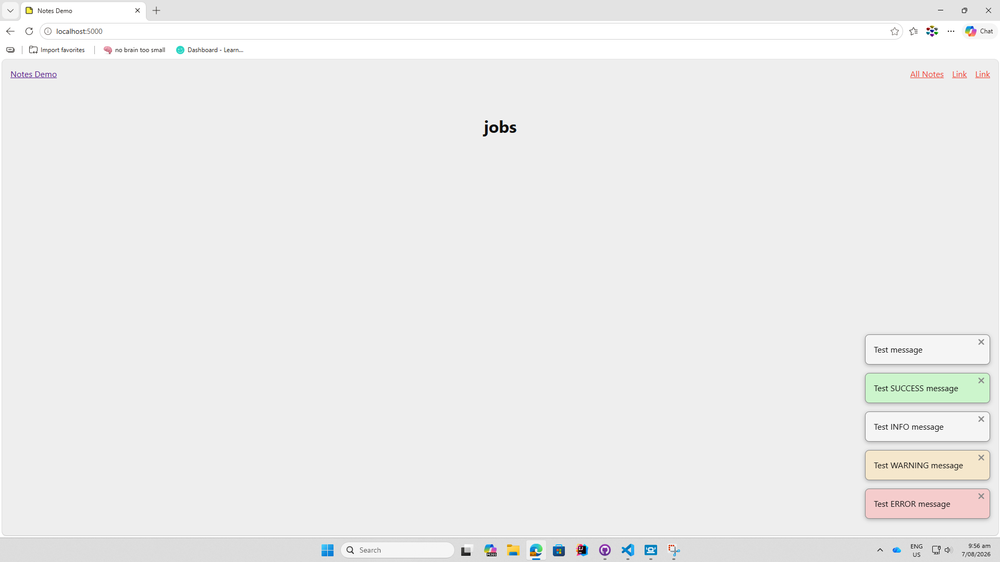
at lest the page is working but still no jobs are showing
### Changes / Improvements
I have the4 first db working on the first page when login or not 
we also have some test data t show this as both the jobs and users table are working 

**PLACE SCREENSHOTS AND/OR ANIMATED GIFS OF THE IMPROVED SYSTEM HERE**
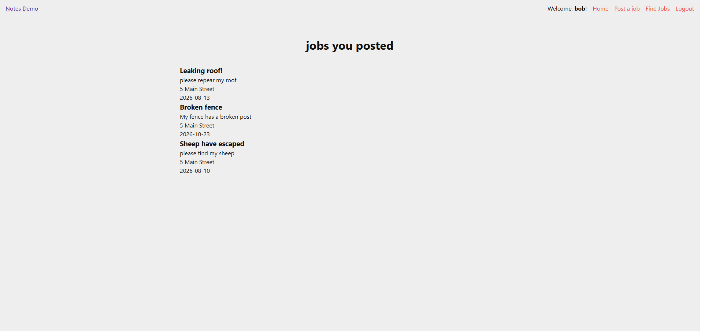

## the offers table

so here wee are testing if i can get the offers table to work and to show the jobs that the user has offered to do 

<video src="screenshots/20260913-2349-40.5372822.mp4" controls title="Title"></video>

as we can see it didn't go very well 

### Changes / Improvements
ok take 2 done a bounch of changes

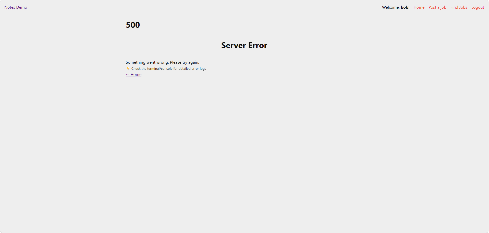
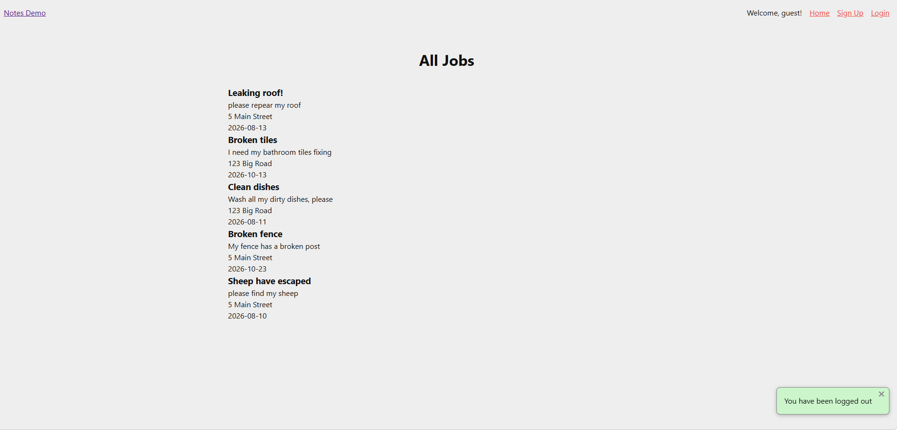
now it's only broken on the login page 

### Changes / Improvements

 so I re-wirte some of the code changed it from a right join to inner join 
and change flask around 

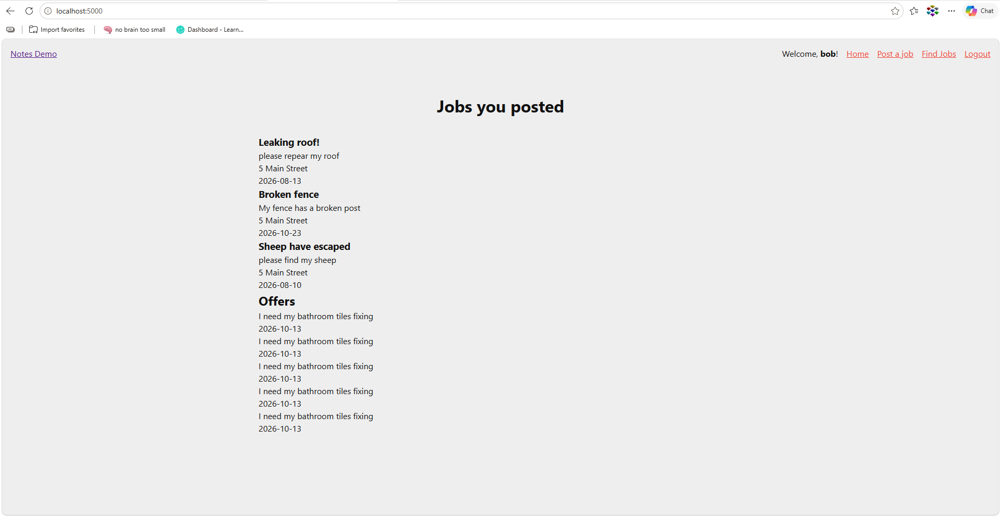

now it works but it is reping the same job for the number of times i apply for if 
which is fine cos i plan on only letting people apply for it once

## refixing the last festure because it broke and i had to make it better so it doesn't do that 

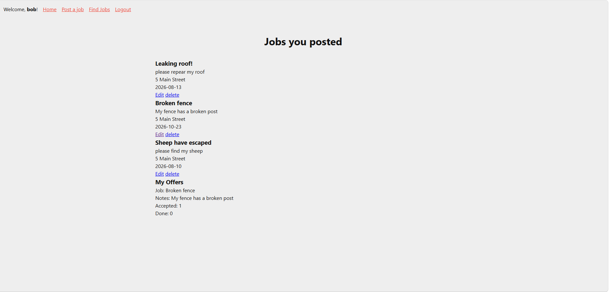

### Changes / Improvements

so to fixed it i removed the inner joint and just ran 3 sql promps one for each table 
and then i would select the data i wanted to show for the offers  

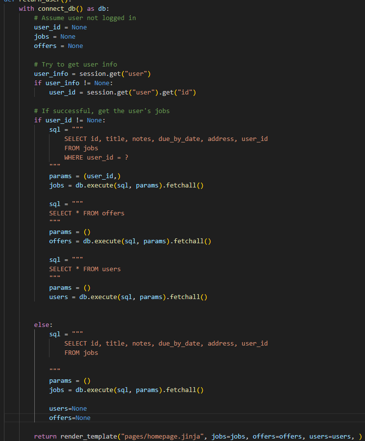

and the home page offer part 
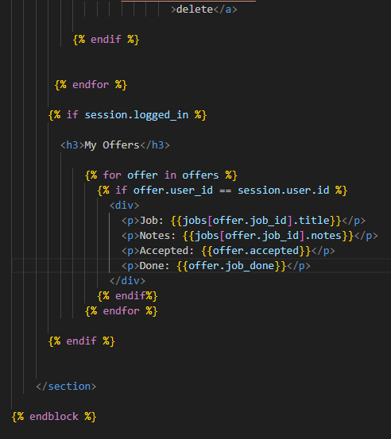

### delate
now the issue is with the delating jobs but it's happening because of my last fix so i need to find one that saterflys both functions 
### inprovements
so i was thinking about it to much I just needed a nomal joint not anything specal like a right or inner joint 
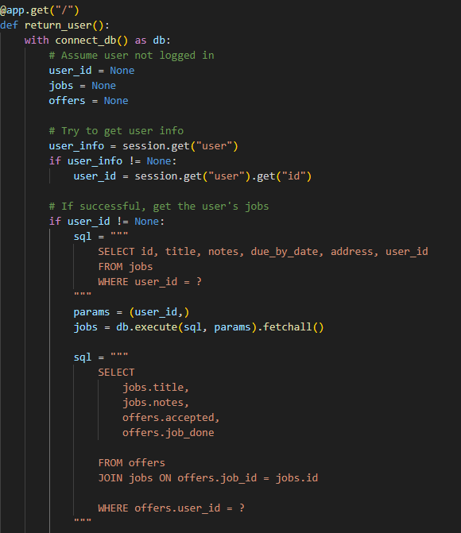

## Sprint Review

this sprint has moved forward my project forward as now all the bascis/main feachers are uasble 

